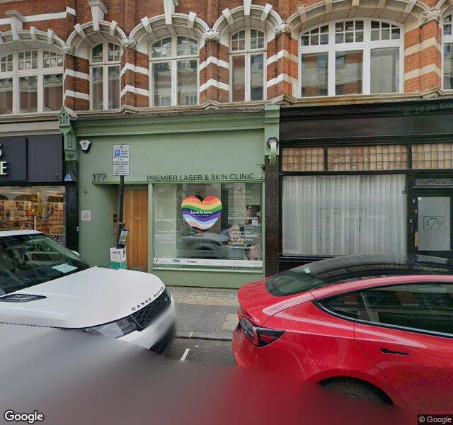
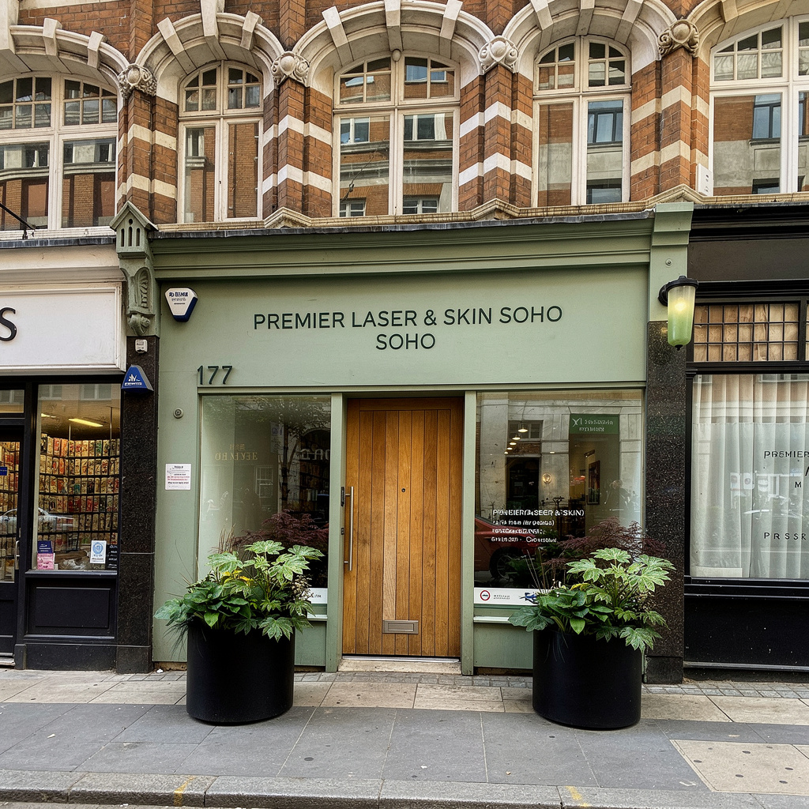
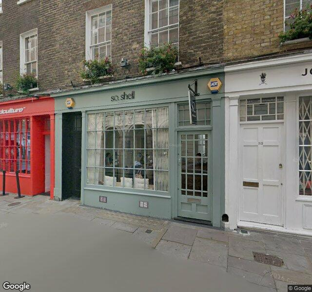
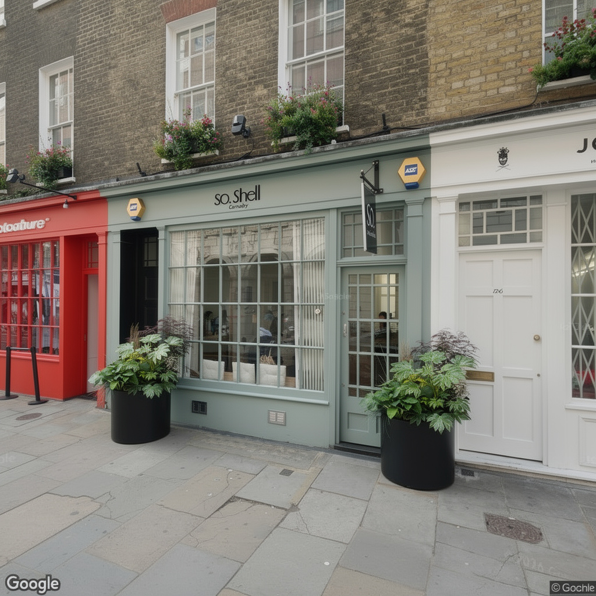
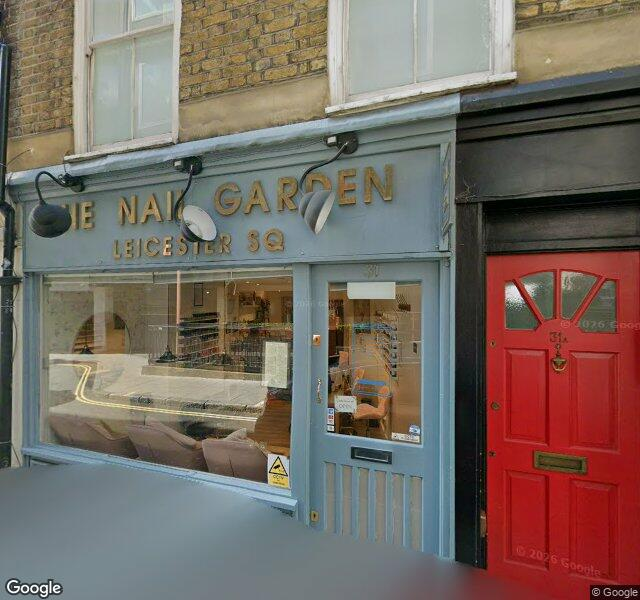
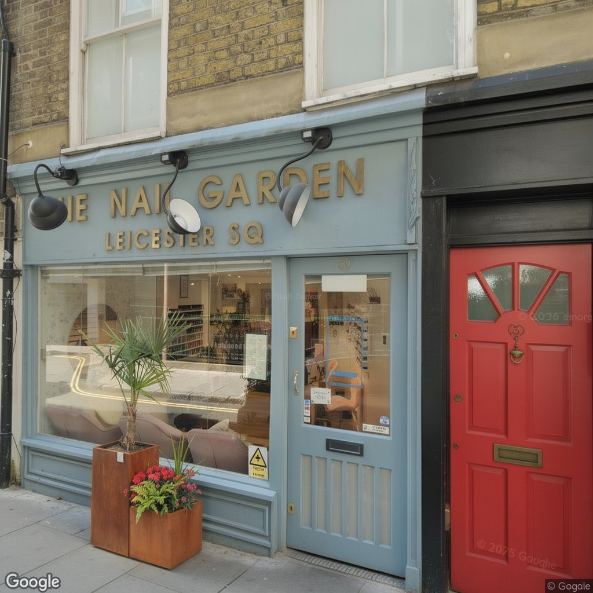

# Storefront AI — Autonomous Prospecting & Visualisation Pipeline

An automated AI prospecting and visualisation system designed to discover street-facing venues, capture centered real-world storefront imagery via Google Street View, and realistically composite commercial planter products into entranceways for high-converting B2B outreach.

---

## What It Does & Why It Was Built

Manual B2B visual outreach is slow and unscalable. This project automates the entire end-to-end prospecting workflow:
1. **Discovers** qualified independent retail businesses (cafés, salons, restaurants) matching target geographic areas and criteria.
2. **Captures & Centers** real storefront entrances using Street View panoramas guided by GPT-4o vision to act as an autonomous camera operator.
3. **Composites** client planter products into the doorway with photorealistic perspective, scale, and lighting using FLUX.2 Max (`flux-2-max`).
4. **Validates Quality** through automated vision checks before approving pitches for outreach.

---

## Pipeline Architecture

```
Google Places API (Discovery)
        ↓
Doorway Capture Agent (Street View + GPT-4o Vision Centering)
        ↓
Planter Generation Agent (BFL Flux.2 Max Compositing)
        ↓
Quality Review Agent (GPT-4o Vision Gate)
        ↓
Approved Visual Pitches
```

- **Venue Discovery:** Queries the Google Places API (New) for street-facing candidates. Filters out non-street-facing units or indoor mall venues.
- **Intelligent Doorway Capture:** Iteratively traverses nearby Street View panoramas and rotates camera headings. GPT-4o vision verifies entrance visibility, signage, centering, and sufficient pavement.
- **Product Compositing:** Ingests the captured frontage alongside client product reference images. Prompts `flux-2-max` to insert matching planters while strictly preserving the building facade and maintaining doorway accessibility.
- **Quality Review Gate:** Evaluates generated images to reject any structural alterations, doorway obstructions, reference mismatches, or hallucinations.

---

## Example Results

Sample outputs generated automatically by the pipeline:

| Venue | Location | Original Frontage | AI-Composited Output |
| :--- | :--- | :---: | :---: |
| **Premier Laser & Skin Soho** | 177 Wardour St, London |  |  |
| **So.Shell Carnaby** | 34 Marshall St, Carnaby, London |  |  |
| **The Nail Garden Leicester Square** | 31 Whitcomb St., London |  |  |

> **Filtering & Rejection Criteria:** Venues located inside shopping centers or with obstructed/non-visible street entrances in outdoor panoramas are automatically filtered out during discovery and capture.

---

## Tech Stack

| Layer | Technology |
| :--- | :--- |
| **Backend** | Python 3.11+ / Flask / SQLite / Background Worker |
| **Discovery** | Google Places API (New) |
| **Frontage Imagery** | Google Street View Static & Metadata APIs |
| **Vision & Quality** | OpenAI GPT-4o |
| **Compositing** | Black Forest Labs (`flux-2-max`) |
| **Frontend** | Vanilla HTML5 / CSS3 / JavaScript |

---

## Quickstart

### 1. Installation
```bash
git clone https://github.com/amarelriany/plant-nursery-case-study.git
cd plant-nursery-case-study
pip install -r requirements.txt
```

### 2. Environment Setup
Create a `.env` file in the root directory:
```env
GOOGLE_MAPS_API_KEY=your_google_maps_key
OPENAI_API_KEY=your_openai_key
BFL_API_KEY=your_bfl_key
```

### 3. Run
```bash
python app.py
```
Open `http://localhost:5000` in your browser.